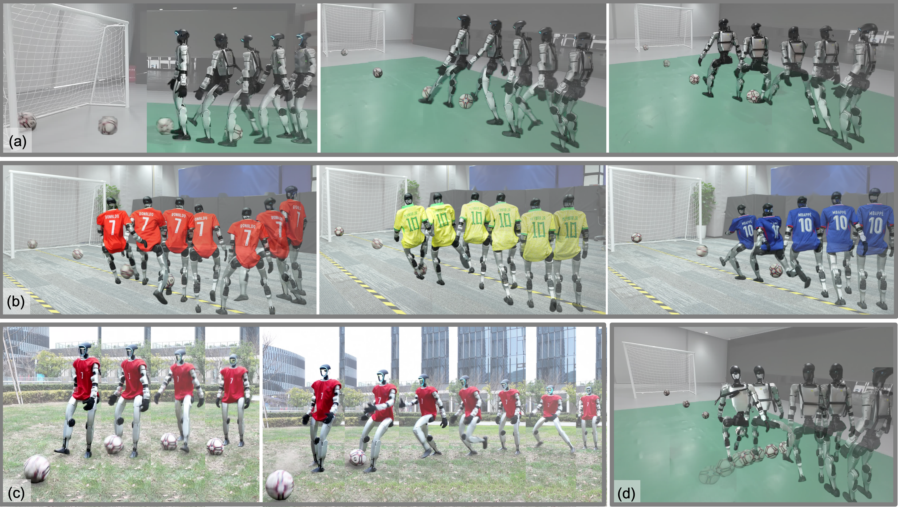

<p align="center">
<h1 align="center"><strong>Learning Soccer Skills for Humanoid Robots</strong></h1>
<h3 align="center">A Progressive Perception-Action Framework</h3>
<p align="center">
<a href="https://kongjipeng.github.io/" target="_blank">Jipeng Kong<sup>*</sup></a>,
<a href="https://xinzheliu.github.io/" target="_blank">Xinzhe Liu<sup>*</sup></a>,
Yuhang Lin,
<a href="https://bwrooney82.github.io/" target="_blank">Jinrui Han</a>,
<a href="https://sist.shanghaitech.edu.cn/soerensch_en/main.htm" target="_blank">Sören Schwertfeger<a>,
<a href="https://baichenjia.github.io/" target="_blank">Chenjia Bai<sup>&dagger;</sup></a>,
<a href="https://scholar.google.com.hk/citations?user=ahUibskAAAAJ" target="_blank">Xuelong Li<sup>&dagger;</sup></a>
<br>
<sup>*</sup> First Author &nbsp;&nbsp; <sup>&dagger;</sup> Corresponding Author
</p>
</p>

<div id="top" align="center">

[](https://soccer-humanoid.github.io/)
[](https://arxiv.org/abs/2602.05310)
[](https://soccer-humanoid.github.io/static/Soccer_arxiv.pdf)
[](https://github.com/TeleHuman/HumanoidSoccer)

</div>

## Overview

This repository contains the official implementation for **Learning Soccer Skills for Humanoid Robots: A Progressive Perception-Action Framework **.

Soccer is a challenging task for humanoid robots, requiring tightly integrated perception and whole-body control. We propose **PAiD (Perception-Action integrated Decision-making)**, a progressive framework with three stages: motion-skill acquisition via human motion tracking, lightweight perception-action integration for positional generalization, and physics-aware sim-to-real transfer. Experiments on the **Unitree G1** show robust, human-like kicking across static/rolling balls, varied positions, disturbances, and indoor/outdoor scenarios.

[]()

## Codebase

This repository contains:
- Core task/environment code: [`source/whole_body_tracking/soccer`](source/whole_body_tracking/soccer)
- Training & play python entrypoints: [`scripts/rsl_rl`](scripts/rsl_rl)
- Shell helpers: [`shell`](shell)
- MuJoCo sim2sim rollout code: [`exp`](exp)
- Motion datasets and labels: [`motions`](motions) 

The kick motions used in our paper are publicly released in [`motions`](motions).


## Installation

- Install Isaac Lab **v2.1.1** by following
  the [installation guide](https://isaac-sim.github.io/IsaacLab/v2.1.1/source/setup/installation/pip_installation.html). We recommend 
  using the Pip installation.

- Clone this repository:

```bash
# Option 1: SSH
git clone git@github.com:TeleHuman/HumanoidSoccer.git

# Option 2: HTTPS
git clone https://github.com/TeleHuman/HumanoidSoccer.git
```

- Using a Python interpreter that has Isaac Lab installed, install the library

```bash
pip install -e source/whole_body_tracking
```

## Training & Play Example
### Training
Train the default rolling-ball soccer policy with the progressive helper:
```bash
bash shell/progressive_soccer_train_play.sh test
```
### Play
```bash
python scripts/rsl_rl/play_multi.py --task Tracking-Flat-G1-SoccerMoving-RNN-v0 \
    --motion_path motions/soccer-standard \
    --load_run <run-name> \
    --num_envs 1  
```

## Progressive Training & Play
### Training
```bash
bash shell/progressive_soccer_train_play.sh test
```

This helper first trains the motion-tracking stage with run name `test`, then resumes it for the rolling-ball soccer stage. Override the defaults with `RUN_NAME=...`, `LOAD_RUN=<run-name>`, `NUM_ENVS=...`, or `MIMIC_MAX_ITERATIONS=...`.

### Play
```bash
python scripts/rsl_rl/play_multi.py --task Tracking-Flat-G1-SoccerMoving-RNN-v0 \
    --motion_path motions/soccer-standard \
    --load_run <run-name> \
    --num_envs 1  
```

##

## TODO

- [x] Release PAiD training code
- [x] Release PAiD motion dataset
- [x] Release PAiD ckpt and sim2sim code
- [ ] Release PAiD domain randomization code

## Citation

If you find this work useful in your research, please consider citing:

```bibtex
@misc{kong2026learningsoccerskillshumanoid,
  title={Learning Soccer Skills for Humanoid Robots: A Progressive Perception-Action Framework},
  author={Jipeng Kong and Xinzhe Liu and Yuhang Lin and Jinrui Han and Sören Schwertfeger and Chenjia Bai and Xuelong Li},
  year={2026},
  eprint={2602.05310},
  archivePrefix={arXiv},
  primaryClass={cs.RO},
  url={https://arxiv.org/abs/2602.05310}
}
```

## License

This codebase is under [CC BY-NC 4.0 license](https://creativecommons.org/licenses/by-nc/4.0/deed.en). You may not use the material for commercial purposes, e.g., to make demos to advertise your commercial products.

## Contact

For further collaborations or discussions, please feel free to reach out to:

- First Author: Jipeng Kong [kongjp2024@shanghaitech.edu.cn](mailto:kongjp2024@shanghaitech.edu.cn) , Xinzhe Liu [liuxzh2023@shanghaitech.edu.cn](mailto:liuxzh2023@shanghaitech.edu.cn).
- Corresponding Author (Chenjia Bai): [baicj@chinatelecom.cn](mailto:baicj@chinatelecom.cn)
